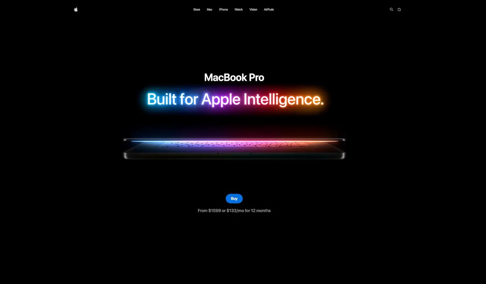

<div align="center">
  <br />
  <br />

  # <code>MACBOOK_GSAP_VUE</code>

  **DIDACTIC CONVERSION / THREEJS LABORATORY**

  <br />

  
  
  
  
  


  <br />
  <br />
</div>

---

### 00 __ PREVIEW



> **ABSTRACT:** Complete conversion of the "Apple Website" project to the Vue 3 ecosystem. This repository has a purely **didactic** focus, translating React/Three.js logic to Vue 3/TresJS to demonstrate how to create immersive 3D experiences in Vue.
>
> <br />
>
> **ORIGIN:** Based on the [Apple Website Course](https://www.youtube.com/watch?v=XUkNR-JfHwo) by [JavaScript Mastery](https://www.youtube.com/@javascriptmastery).
> *Adapted to Vue 3 ecosystem by user with extensive educational comments.*

---

### 01 __ ARCHITECTURE & DECISIONS

| COMPONENT | TECH | NOTE |
| :--- | :--- | :--- |
| **Core** | `Vue 3 (Composition API)` | Script Setup syntax only. |
| **3D Engine** | `TresJS` | Declarative Three.js ecosystem for Vue. |
| **State** | `Pinia` | State management for model configuration. |
| **Motion** | `GSAP` | ScrollTrigger, Timeline, and TextPlugin. |
| **Styling** | `Tailwind CSS` | Utility-first for structure and design. |

<br>

### 02 __ INSTALLATION

*Run local environment:*

```bash
# 1. Clone
git clone https://github.com/samuhlo-training/macbook-threejs-gsap-course.git

# 2. Install dependencies
bun install

# 3. Ignite
bun run dev
```

### 03 __ EDUCATIONAL VALUE

This tailored version focuses on the **Vue implementation** of complex 3D scenes.

#### A. REACTIVE 3D SCENES
Use of `@tresjs/cientos` components to handle 3D environments declaratively, replacing imperative React hooks.

#### B. GSAP INTEGRATION
Implementation of `gsap.context()` and `onMounted/onUnmounted` Lifecycle to ensure clean memory management in Vue components.

```typescript
// Example of how we handle GSAP cleanup in Vue 3
let ctx: gsap.Context;

onMounted(() => {
  // We initialize ScrollTrigger with a context for easy cleanup
  ctx = gsap.context(() => {
    gsap.to(modelRef.value.position, {
      y: -1,
      scrollTrigger: {
        trigger: '#section-3d',
        start: 'top bottom',
        scrub: true
      }
    })
  })
})

// Essential for SPA navigation - registered at top level
onUnmounted(() => {
  ctx?.revert();
});
```

<div align="center">


<code>VUE ADAPTATION BY <a href='https://github.com/samuhlo'>samuhlo</a></code>
<br>
<small>Original Design & Concept by JavaScript Mastery</small>


<small>Lugo, Galicia</small> </div>